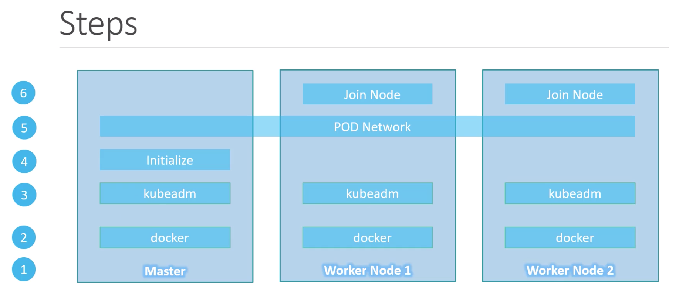
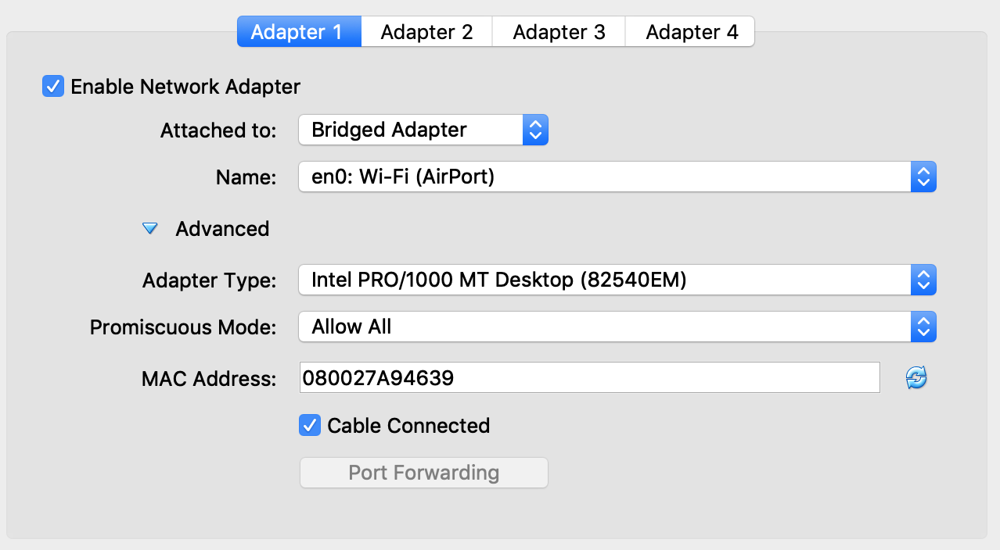
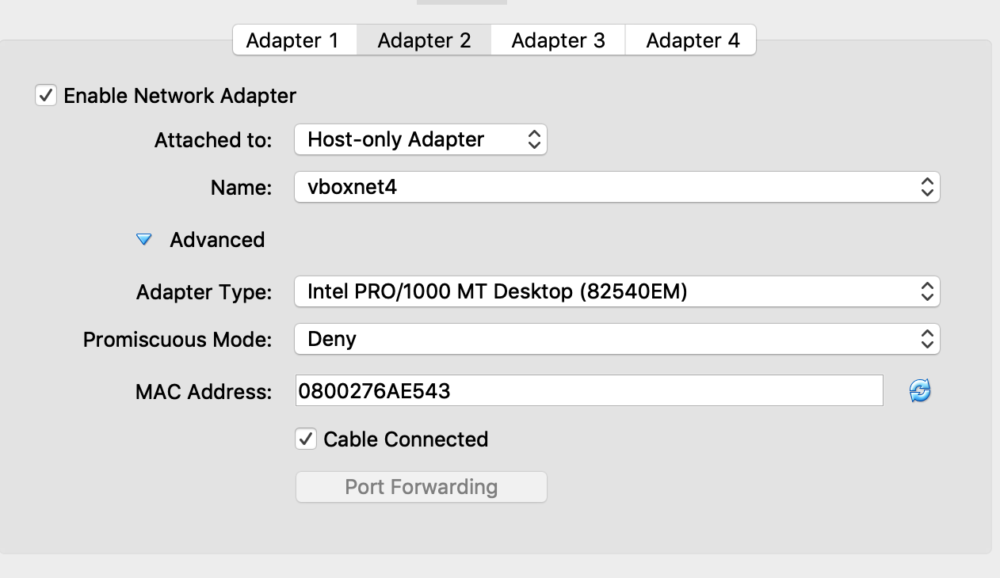
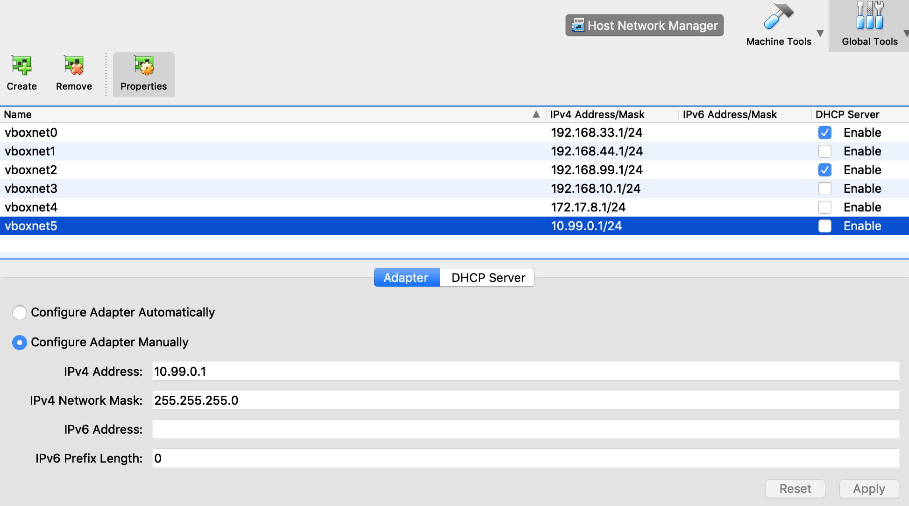
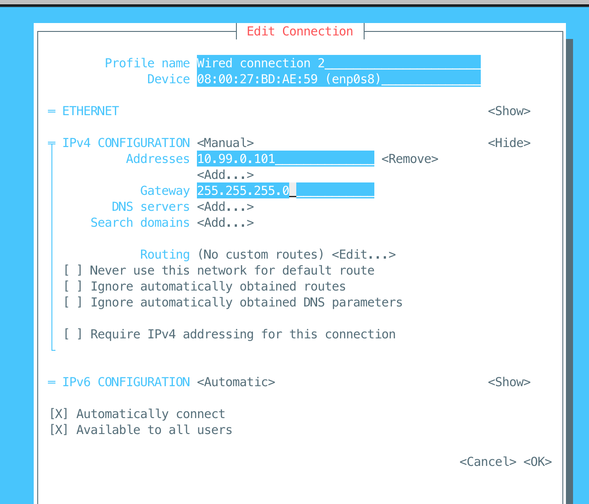

# Big Picture

 


#### Assumptions

|Role|FQDN|IP|OS|RAM|CPU|
|----|----|----|----|----|----|
|Master1|ct-kmaster1|10.99.0.101|CentOs 7.6|2G|2|
|Node1|ct-knode1|10.99.0.201|CentOs 7.6|1G|1|
|Node2|ct-knode2|10.99.0.202|CentOs 7.6|1G|1|


# Step 1 : Provision VM 

[CentOS 7.6 Link Download](https://sourceforge.net/projects/osboxes/files/v/vb/10-C-nt/7/7-18.10/181064.7z/download) 


### On both ct-kmaster1 , ct-knode1 and ct-knode2
#### Pre-requisites 
Set network adapter all VM as image below


 

 

 


#### Edit `/etc/hosts` file

```
# kube-master1 /etc/hostname
127.0.0.1 kubemaster1
```

```
# ct-knode1 /etc/hostname
127.0.0.1 ct-knode1
```

```
# ct-knode2 /etc/hostname
127.0.0.1 ct-knode2
```

#### Edit Hostname and  Static Ip for Adapter 2 ( POD network )
```
nmtui
```

 


# Step 2 : Install Docker

## Step 1: Disable SELinux & setup firewall rules
Login to your `ct-kmaster1` node and set the hostname and disable selinux using following commands


```
setenforce 0

sed -i --follow-symlinks 's/SELINUX=enforcing/SELINUX=disabled/g' /etc/sysconfig/selinux
```


```
firewall-cmd --permanent --add-port=6443/tcp
firewall-cmd --permanent --add-port=2379-2380/tcp
firewall-cmd --permanent --add-port=10250/tcp
firewall-cmd --permanent --add-port=10251/tcp
firewall-cmd --permanent --add-port=10252/tcp
firewall-cmd --permanent --add-port=10255/tcp
firewall-cmd --reload
modprobe br_netfilter
echo '1' > /proc/sys/net/bridge/bridge-nf-call-iptables

```

Note: In case you don’t have your own dns server then update /etc/hosts file on `ct-kmaster1`, `ct-knode1` and `ct-knode2`
```
nano /etc/hosts
```

```
10.99.0.101 ct-kmaster1
10.99.0.201 ct-knode1
10.99.0.202 ct-knode2

```

Disable Swap off
```
swapoff -a

nano /etc/fstab
# comment Swap line
```


## Step 2: Configure Kubernetes Repository
Kubernetes packages are not available in the default CentOS 7 & RHEL 7 repositories, Use below command to configure its package repositories.

```
cat <<EOF > /etc/yum.repos.d/kubernetes.repo
[kubernetes]
name=Kubernetes
baseurl=https://packages.cloud.google.com/yum/repos/kubernetes-el7-x86_64
enabled=1
gpgcheck=1
repo_gpgcheck=1
gpgkey=https://packages.cloud.google.com/yum/doc/yum-key.gpg
        https://packages.cloud.google.com/yum/doc/rpm-package-key.gpg
EOF
```

## Step 3: Install Kubeadm and Docker
```
yum install kubeadm docker -y

```

Start and enable kubectl and docker service

```
systemctl restart docker && systemctl enable docker
systemctl  restart kubelet && systemctl enable kubelet
```

## Step 4: Initialize Kubernetes Master with ‘kubeadm init’
Run the beneath command to  initialize and setup `ct-kmaster1`.

```
kubeadm init --pod-network-cidr=192.168.0.0/16 --apiserver-advertise-address={Local_IP}
```


```
kubeadm join 10.24.10.47:6443 --token igf8jj.xz2i2yc0fbukzm4s \
    --discovery-token-ca-cert-hash sha256:bfae1c209ccf3026f3ec485a1d76aef4443f15aba3a2b75d920742ec24eb3557
```

To make kubectl work for your non-root user, run these commands, which are also part of the kubeadm init output:

```
mkdir -p $HOME/.kube
sudo cp -i /etc/kubernetes/admin.conf $HOME/.kube/config
sudo chown $(id -u):$(id -g) $HOME/.kube/config

```


## Step 5: Deploy pod network to the cluster
Try to run below commands to get status of cluster and pods.
```
kubectl get nodes
```

```
kubectl get pods --all-namespaces
```

Run the beneath command to deploy network.

```
export kubever=$(kubectl version | base64 | tr -d '\n')
```

```
kubectl apply -f https://docs.projectcalico.org/v3.8/manifests/calico.yaml
```


# Perform the following steps on each worker node

## Step 1: Disable SELinux & configure firewall rules on both the nodes
```
setenforce 0
sed -i --follow-symlinks 's/SELINUX=enforcing/SELINUX=disabled/g' /etc/sysconfig/selinux

firewall-cmd --permanent --add-port=6443/tcp
firewall-cmd --permanent --add-port=2379-2380/tcp
firewall-cmd --permanent --add-port=10250/tcp
firewall-cmd --permanent --add-port=10251/tcp
firewall-cmd --permanent --add-port=10252/tcp
firewall-cmd --permanent --add-port=10255/tcp
firewall-cmd --reload
modprobe br_netfilter
echo '1' > /proc/sys/net/bridge/bridge-nf-call-iptables

```

## Step 2: Configure Kubernetes Repositories on both worker nodes
```
cat <<EOF > /etc/yum.repos.d/kubernetes.repo
[kubernetes]
name=Kubernetes
baseurl=https://packages.cloud.google.com/yum/repos/kubernetes-el7-x86_64
enabled=1
gpgcheck=1
repo_gpgcheck=1
gpgkey=https://packages.cloud.google.com/yum/doc/yum-key.gpg
        https://packages.cloud.google.com/yum/doc/rpm-package-key.gpg
EOF

```
## Step 3: Install kubeadm and docker package on both nodes

```
yum  install kubeadm docker -y
systemctl restart docker && systemctl enable docker
```


## Step 4: Now Join worker nodes to master node
```
kubeadm join 10.24.10.47:6443 --token igf8jj.xz2i2yc0fbukzm4s \
    --discovery-token-ca-cert-hash sha256:bfae1c209ccf3026f3ec485a1d76aef4443f15aba3a2b75d920742ec24eb3557

```

Now verify Nodes status from master node using kubectl command

```
kubectl get nodes

```


[Sample YAML POD, Replication, ReplicaSet](https://github.com/boonkuaeb/kubernetes-install-cluster-ubunt16-04/tree/master/yaml) 

